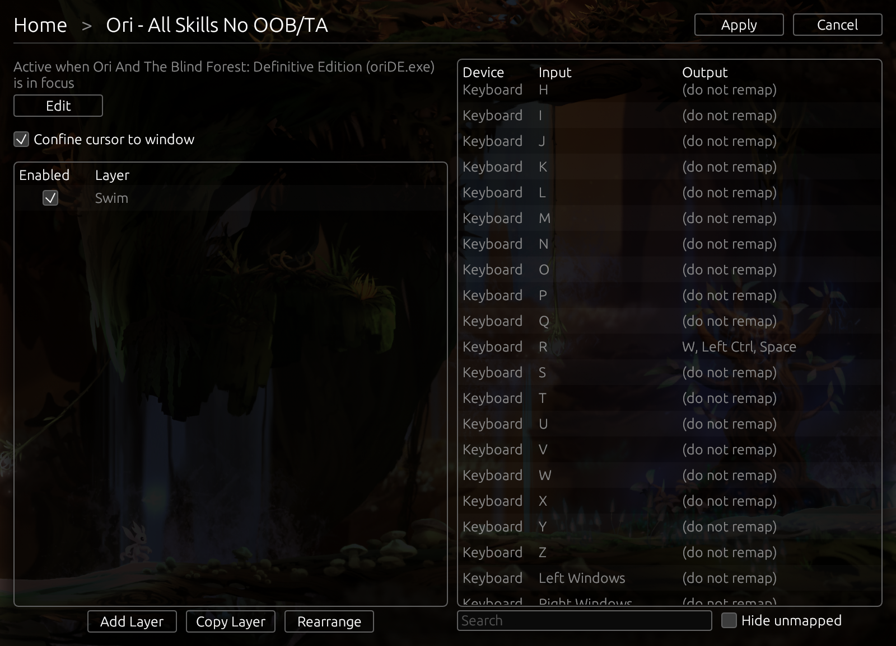

+++
title = "Reemap"
sort_by = "weight"
+++

Reemap is an input remapping tool for Windows. It runs in the background
and remaps keyboard and mouse inputs.

Reemap is named after Reem, the spirit in [Ori and the Blind Forest][Ori] whose ancestral
tree grants Bash.

Reemap was originally developed for [Ori] speedrunners who use input remaps.

# Features

- **Profiles** - remap inputs differently for each program
- **Layers** - conditionally override inputs in a profile
- **Keyboard and mouse** - freely map keyboard inputs to mouse inputs, and vice versa
- **Multi maps** - map one input to multiple outputs
- **Export and import profiles** - share or back up profiles
- **Confine cursor to window** - prevent the mouse from leaving the window (useful for fullscreen
games on multi-monitor setups)

[Ori]: https://www.orithegame.com/